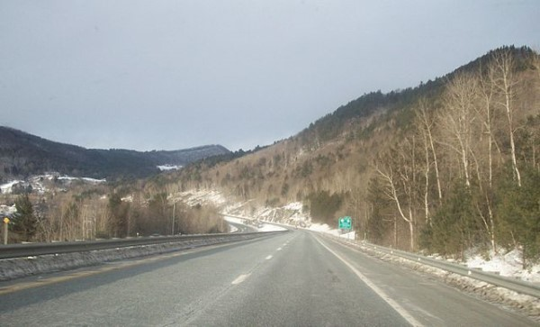
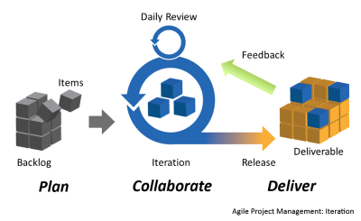
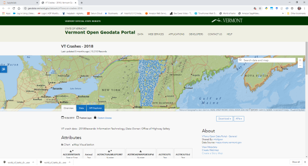
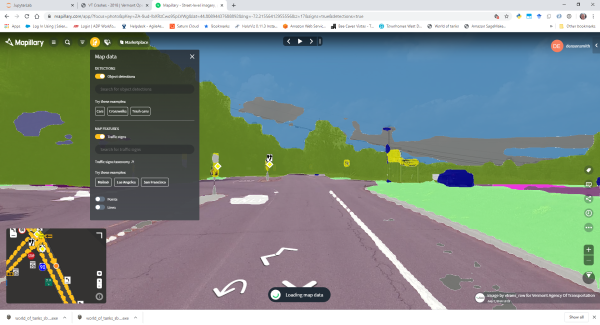
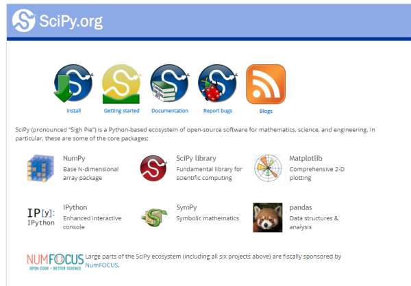
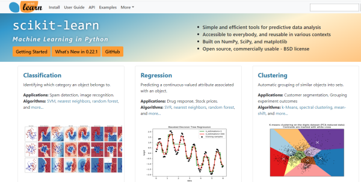
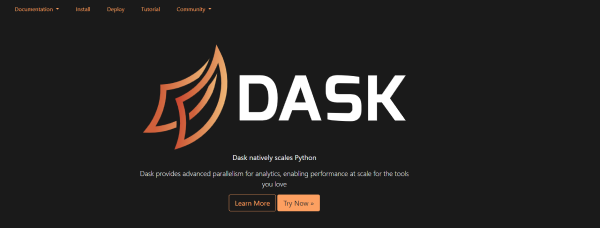
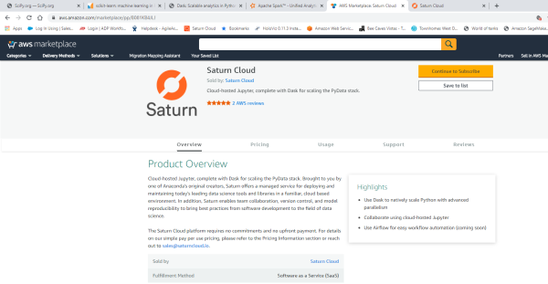
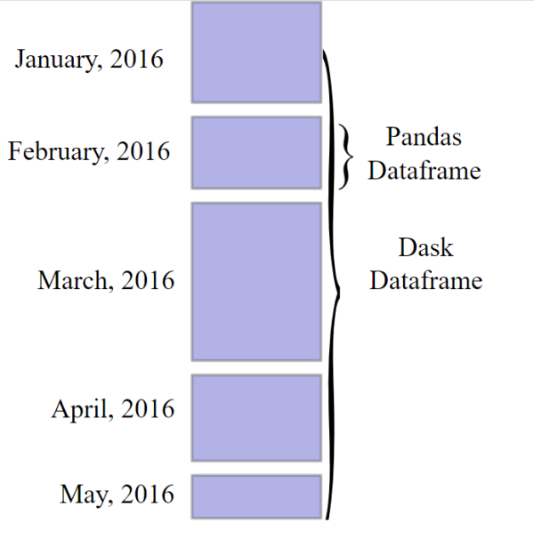
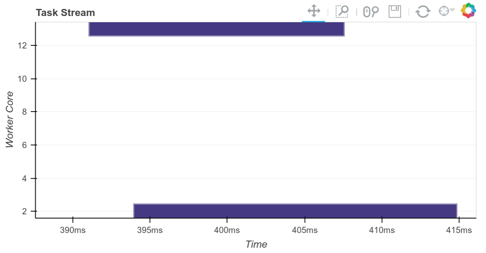

# Traffic Safety Analytics Case Study

### This is designed to be a case study of a real data analytics project. 

> ### 1. Project management
> ### 2. Computational and Data resource management
> ### 3. Analytics and modeling
> ### 4. Deployment and usage

# Business Value

### This will be a fairly complex project so we need a framework for measuring costs and benefits.

## The V's of Data

###  `Value`         - Some measureable value we extract from data

#### Our goal is to extract as much `value` as possible while minimizing cost:

> #### 1. `Volume`        - The size of the data 
> #### 2. `Variety`       - The different types of data
> #### 3. `Veracity`      - The trustworthiness of the data in terms of accuracy
> #### 4. `Velocity`      - The speed at which the data is generated
> #### 5. `Visualization` - The data in a manner that is readable and accessible
> #### 6. `Variability`   - The meaning or structure of new data changes over time

Each of the V's has a tradeoff in value vs cost. For example, retaining lots of data for a long time means added storage cost. Whether the storage cost is worth it depends upon the value we extract from the data. Consider that we might not be aware today of the future value containined in the data.

## Project Management Methodologies

We use CRISP-DM methodology to feed Agile roadmaps.

# The Data

We will be integrating traffic accident data with weather data and a variety of images and other data from Mapillary.

[")](https://www.ncei.noaa.gov/about)

Traffic accident data from the Vermont Open Geodata Portal.

- [VT Crashes - 2016](http://geodata.vermont.gov/datasets/VTrans::vt-crashes-2016)
- [VT Crashes - 2017](http://geodata.vermont.gov/datasets/VTrans::vt-crashes-2017)
- [VT Crashes - 2018](http://geodata.vermont.gov/datasets/VTrans::vt-crashes-2018)

The weather data will be retrieved from the [National Centers for Environmental Information (NCEI) Web Service API](https://www.ncdc.noaa.gov/cdo-web/webservices/v2).

NOAA's National Centers for Environmental Information (NCEI) is responsible for preserving, monitoring, assessing, and providing public access to the Nation's treasure of climate and historical weather data and information.

[Mapillary](https://www.mapillary.com/) offers a variety of free and paid services for street level imagery.

# Technology Stack

- [SciPy](https://www.scipy.org/) - SciPy (pronounced “Sigh Pie”) is a Python-based ecosystem of open-source software for mathematics, science, and engineering.
- [scikit-learn](https://scikit-learn.org/stable/) - Simple and efficient tools for predictive data analysis
- [Dask](https://dask.org/) - Dask natively scales Python
- [Saturn Cloud](https://www.saturncloud.io) - Manage and scale team analytics in the cloud

# General strategy for completing the tasks involved:

### 1. Complete the task on a small sample of data using Pandas and other SciPy tools.
### 2. If needed, adapt the SciPy only solution to Dask running on a single machine
### 3. If needed, adapt the single machine solution to a Dask cluster in the cloud.

## Many V's of Data

We started off with the 3 V's of big data but there seems to be a race to find more V's.

[Volume, velocity, and variety: Understanding the three V's of big data](https://www.zdnet.com/article/volume-velocity-and-variety-understanding-the-three-vs-of-big-data/)

> The original leaves out `Value` which is the most important.

[The four V's of Data](https://www.dummies.com/careers/find-a-job/the-4-vs-of-big-data/)
>Strangely, this article has 5 V's.

[The 10 Vs of Big Data](https://tdwi.org/articles/2017/02/08/10-vs-of-big-data.aspx)

> This has several that are not on our list:
> - Validity - We are treating this as part of Veracity
> - Vulnerability - Security of the data
> - Volatility - How long before the data no longer has value and should be discarded

[The 42 V's of Big Data and Data Science](https://www.elderresearch.com/blog/42-v-of-big-data)

> Now we need data science to study the V's buzzword inflation. Tom Shafer does a pretty good job of it.

#### Peer review journal article

This article mentions both the 3 V's and 7 V's of Big Data:

[Data Science Algorithms and Techniques for Smart Healthcare Using IoT and Big Data Analytics: Towards Smarter Algorithms](https://www.researchgate.net/publication/330723399_Data_Science_Algorithms_and_Techniques_for_Smart_Healthcare_Using_IoT_and_Big_Data_Analytics_Towards_Smarter_Algorithms)

# The most important V of data:

- ## Value

<iframe width="640" height="320" src="https://embed-v1.mapillary.com/embed?version=1&filter=%5B%22all%22%5D&map_filter=%5B%22all%22%5D&map_style=Mapillary streets&image_key=H2253z5L0jAEsGcLp7amfw&x=0.5000000000000001&y=0.5&client_id=MWlUMjBCenlpLXp0OWk0NXhqODJfdzplNzcxMzc4YTZjN2Y3NzVm&style=split" frameborder="0"></iframe>

